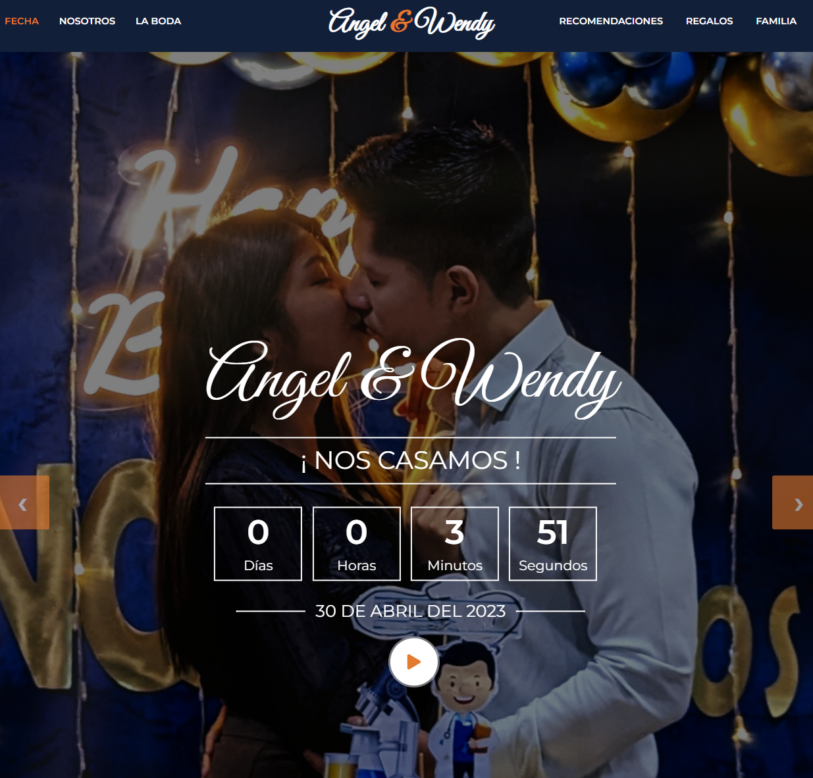
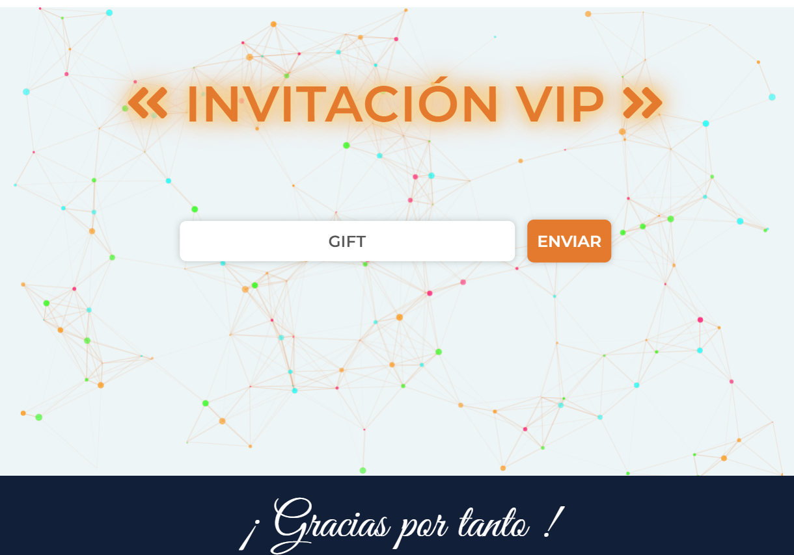
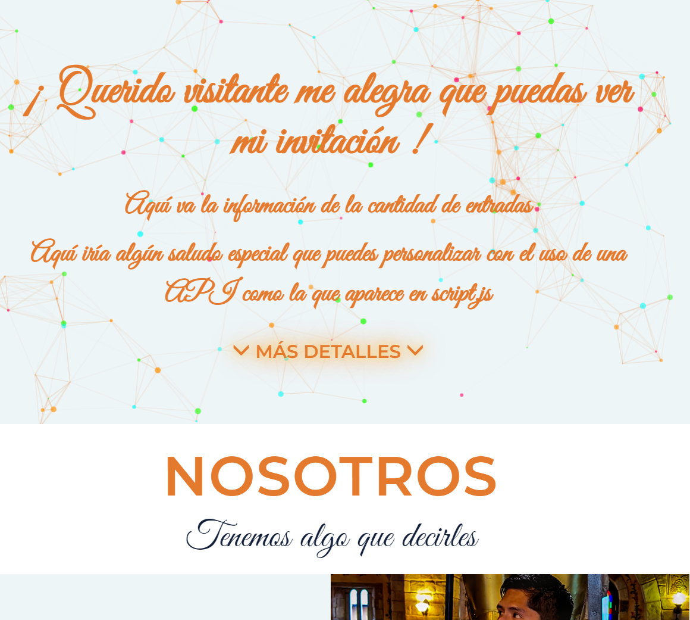

<h1>Nuestra Boda A&W | A&W Wedding</h1>

Welcome to the A&W Wedding repository. This project is a customized online wedding invitation designed responsively to adapt to various mobile devices and desktop computers. The invitation features a unique secret code for each guest, which, upon entering, reveals the full content of the website.

  

## Demo
To preview the project, please visit https://aramir95.github.io/OurWedding.io/ and enter the secret code GIFT. This code has been enabled for GitHub visitors.

  

## Features
- Responsive design that adapts to different devices and screen sizes.
- Customizable countdown timer in the script.js file.
- Personalized secret code that reveals the full website upon entry.
- Script.js is programmed to make an API query to a cloud-hosted SQL database. This can be modified to use a different custom API.
-Bootstrap is utilized for the website's design, making it lightweight and fast to load.
- Elements and sections were customized to integrate detailed event information.
- Python scripts were used to link and update the guest list "guest.xlsx" on Google Cloud SQL and deploy an API on the cloud console, which is enabled for guest queries. Python scripts were also employed to analyze, update, and personalize greetings in the database and automate WhatsApp message sending using the Selenium WebDriver.

  

### Proyecto OurWedding.io | Wedding Website | Página Web de Boda

Bienvenido al repositorio del proyecto <strong>Nuestra Boda A&amp;W</strong>. Este proyecto es una invitación de boda en línea personalizada y diseñada con un estilo responsivo para adaptarse a diferentes dispositivos móviles así como ordenadores de escritorio . La invitación cuenta con un código secreto personalizado por invitado, que al ingresarlo, despliega el contenido completo de la página web.

## Demo
Para visualizar el proyecto, puedes visitar https://aramir95.github.io/OurWedding.io/ e ingresar el código secreto GIFT. Este código ha sido habilitado para los visitantes de GitHub.

## Características
- Diseño responsivo que se adapta a diferentes dispositivos y tamaños de pantalla.
- Hace uso de un reloj temporizador que puede ser modificado con la fecha deseada en el archivo script.js
- Código secreto personalizado que despliega la página web completa una vez ingresado.
- Script.js está programado para hacer una consulta api para consultar a una base de datos SQL en cloud. Esto puede modificarse para usar otra api de consulta personalizada.
- Bootstrap es usado para el diseño de esta página web,por lo que es bastente ligera y rápida de cargar.
- Los elementos y secciones fueron personalizados para integrar la información detallada del evento.
- En este proyecto también se hizo uso de scripts de python para enlazar y actualizar la lista de invitados "guest.xlsx" en Google Cloud SQL, así como se hizo uso de una api desplegada en la consola cloud y habilitada para ser consultada por los invitados. Del mismo modo se hizo de scripts de python para analizar, actualizar, y personalizar saludos en la base de datos, así como también para automatizar el envío de mensajes a través de whatsapp usando selenium webdriver .

## Scripts de Python usados

#### ActualizarSQL.py
Este script se encarga de establecer una conexión con una base de datos SQL de Google Cloud, que tú como desarrollador has creado. Utiliza la información almacenada en el archivo guest.xlsx para generar una tabla y actualizar los códigos de invitación personalizados. Esto facilita la gestión de invitaciones, ya que puedes automatizar el proceso de generar códigos únicos y asignarlos a cada invitado.

#### wsp_envio_mensaje_auto.py
Este script utiliza Selenium para automatizar el envío de mensajes de WhatsApp. Utiliza los datos almacenados en la hoja de cálculo to_wsp.xlsx para enviar mensajes personalizados a través de WhatsApp. El script recorre cada fila de la hoja de cálculo y envía los mensajes a los destinatarios correspondientes. Esto te permite ahorrar tiempo y esfuerzo al enviar mensajes repetitivos a múltiples destinatarios.